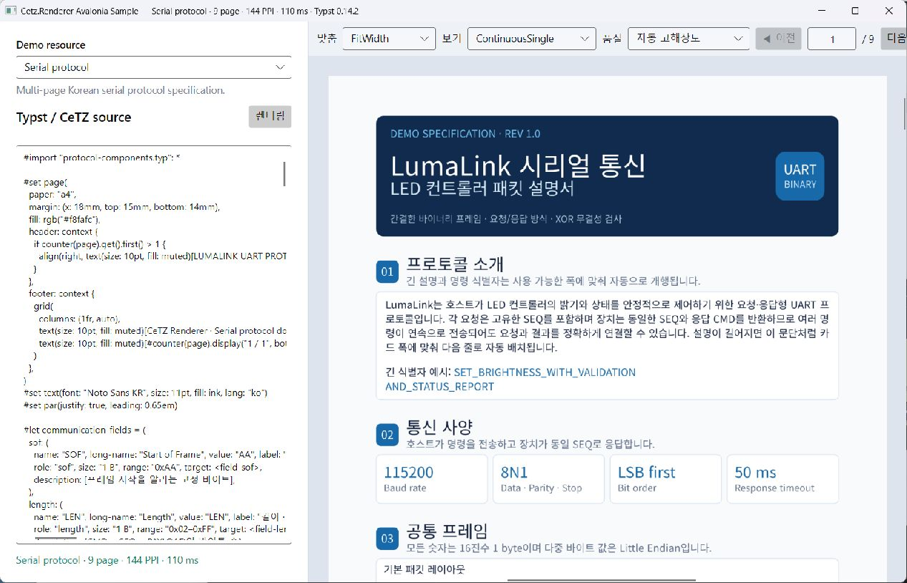
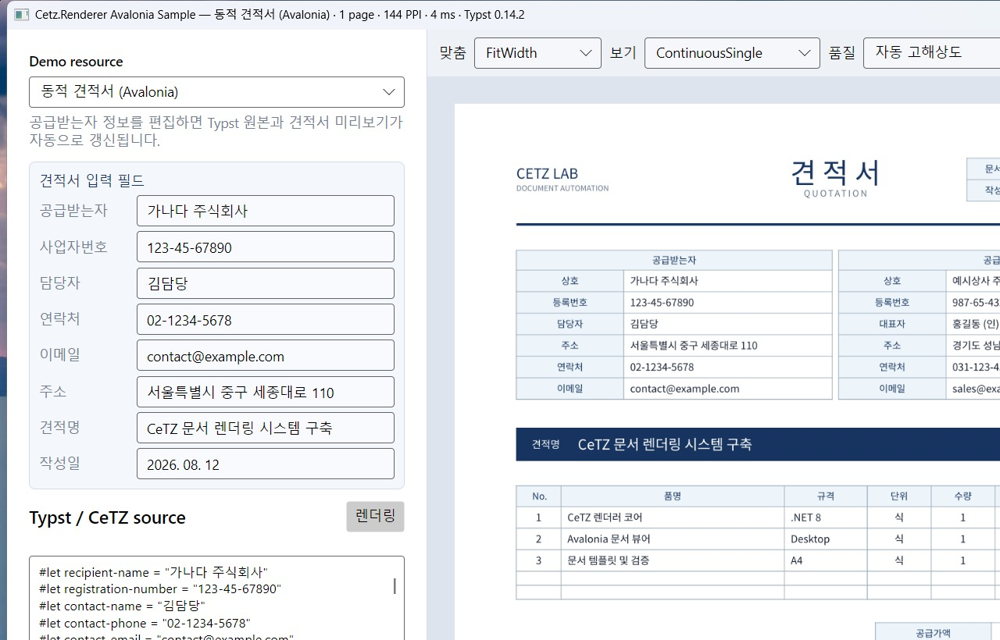
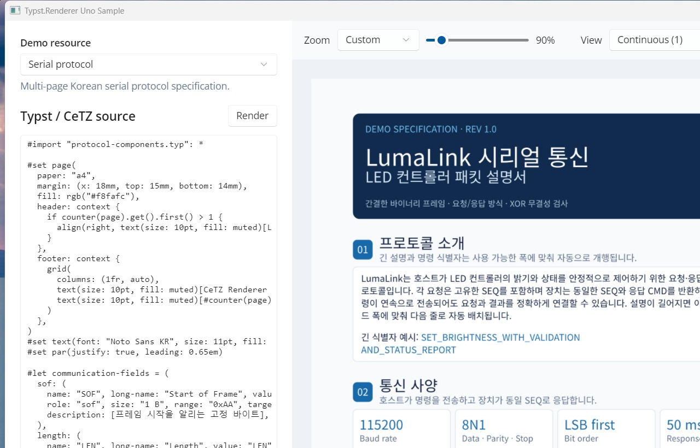
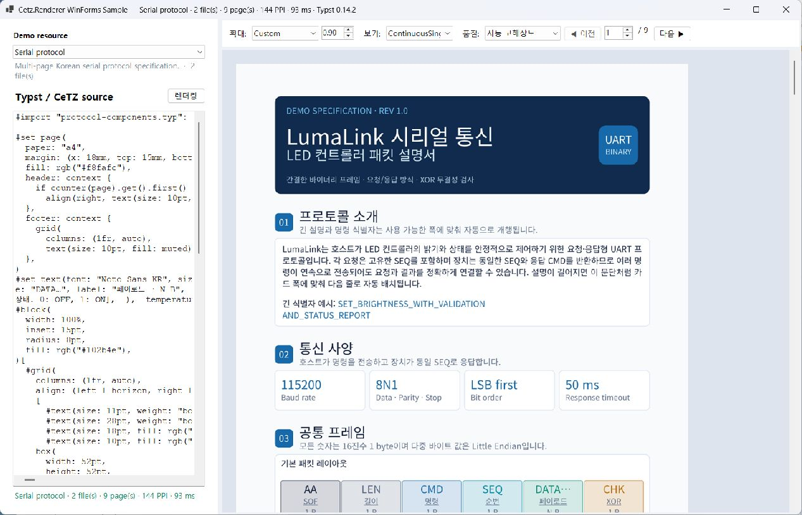
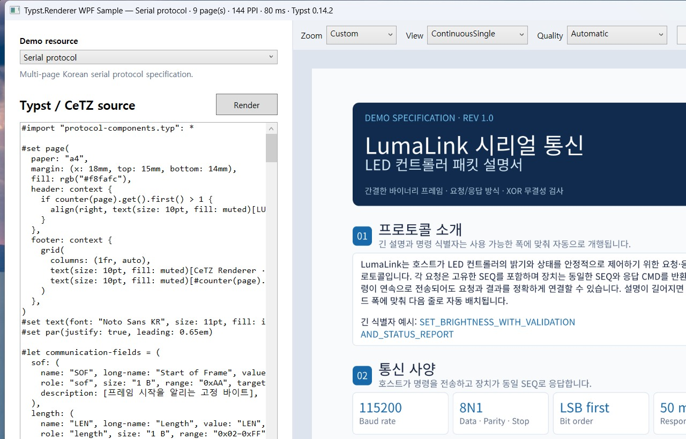
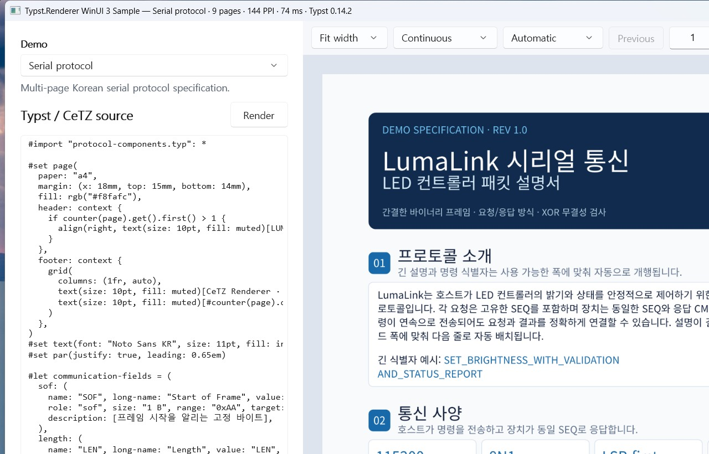

# Typst.Renderer

[English](README.md)

Typst 0.14.2와 CeTZ 0.5.2를 프로세스 내부에서 렌더링하는 운영 환경 지향
.NET 8 SDK입니다. 패키지는 SVG, PNG, PDF 또는 premultiplied RGBA8 결과를
관리 메모리로 반환합니다. `typst.exe`, `cetz-render`, Node 또는 Sharp를 실행하지
않습니다.

## 패키지

런타임 패키지 하나를 참조하면 정확히 일치하는 관리 패키지가 함께 설치됩니다.

```xml
<PackageReference Include="Typst.Renderer.Native.win-x64" Version="0.1.0" />
```

Linux x64에서는 `Typst.Renderer.Native.linux-x64`를 사용합니다. 네이티브 자산은
NuGet의 `runtimes/{rid}/native/` 규칙을 따릅니다.

네이티브 SDK가 모든 UI 프레임워크로부터 독립성을 유지하도록 GUI 통합 계층을
분리했습니다.

- `Typst.Renderer.Core`는 렌더러 결과를 화면 표시용 RGBA 문서로 변환하며 공통
  렌더링, 확대/축소, 레이아웃, 보기 모드 및 탐색 동작을 담당합니다.
- `Typst.Renderer.Avalonia`는 재사용 가능한 `TypstView`로 문서를 표시합니다.
- `Typst.Renderer.Uno`는 재사용 가능한 WinUI/Uno `TypstView`로 문서를 표시합니다.
- `Typst.Renderer.WinForms`는 DPI 인식 확대/축소와 다중 페이지 스크롤을 지원하는
  Windows Forms 네이티브 `TypstView`를 제공합니다.
- `Typst.Renderer.Wpf`는 같은 문서를 재사용 가능한 WPF `TypstView`로 표시합니다.
- `Typst.Renderer.WinUI`는 현재 안정 버전 Windows App SDK 기반의 재사용 가능한
  WinUI 3 `TypstView`를 제공합니다. 대상 프레임워크는
  `net8.0-windows10.0.19041.0`입니다.
- 모든 GUI 어댑터는 하나의 보기/렌더링 계약을 공유합니다. 맞춤, 페이지 모드,
  탐색, 수명 주기 및 데모 요구사항은
  [GUI 어댑터 계약](docs/gui-adapter-contract.md)을 참고하세요.

## GUI 샘플

아래 데스크톱 샘플의 기본 화면은 모두 같은 창 크기를 사용하며
`Typst.Renderer.Demo.Shared`의 동일한 9페이지 `Serial protocol` 프로젝트를
렌더링합니다. 두 번째 Avalonia 화면은 추가된 실시간 견적서 작업 흐름입니다.

| [Avalonia](samples/Typst.Renderer.Avalonia.Sample/) |
| --- |
|  |

| [Avalonia — 동적 견적서](samples/Typst.Renderer.Avalonia.Sample/) |
| --- |
|  |

| [Uno Platform](samples/Typst.Renderer.Uno.Sample/) |
| --- |
|  |

| [Windows Forms](samples/Typst.Renderer.WinForms.Sample/) |
| --- |
|  |

| [WPF](samples/Typst.Renderer.Wpf.Sample/) |
| --- |
|  |

| [WinUI 3](samples/Typst.Renderer.WinUI.Sample/) |
| --- |
|  |

## Avalonia

공통 Core 계층으로 렌더링한 결과를 Avalonia 뷰에 할당합니다.

```csharp
using Typst.Renderer.Avalonia;
using Typst.Renderer.Core;

using var renderer = new TypstDocumentRenderer();
var document = await renderer.RenderSourceAsync(typstSource);

var view = new TypstView
{
    Document = document,
    Zoom = 1.0
};
```

저장소 루트에서 편집기와 미리보기 대화형 샘플을 실행합니다.

```powershell
dotnet run --project samples/Typst.Renderer.Avalonia.Sample
dotnet run --project samples/Typst.Renderer.Avalonia.Sample -- --demo live-quotation
```

샘플의 데모 선택기는 `Typst.Renderer.Demo.Shared`를 사용합니다. 내장된 9개 예제는
UI와 독립적인 인메모리 프로젝트이므로 모든 GUI 데모가 파일을 복사하지 않고
동일한 카탈로그를 재사용합니다. Avalonia 전용 `동적 견적서` 예제는 편집 가능한
공급받는자 필드를 제공하며 Typst 원본과 렌더링 미리보기를 자동으로 갱신합니다.

## WPF

`Typst.Renderer.Wpf`는 `net8.0-windows`를 대상으로 하며 별도 서드파티 런타임
의존성이 없습니다. 다중 페이지 스크롤을 사용하려면 WPF `ScrollViewer` 안에
뷰를 배치합니다.

```csharp
using Typst.Renderer.Core;
using Typst.Renderer.Wpf;

using var renderer = new TypstDocumentRenderer();
var document = await renderer.RenderSourceAsync(typstSource);

var view = new TypstView
{
    Document = document,
    Zoom = 1.0,
    PageSpacing = 24
};
var preview = new System.Windows.Controls.ScrollViewer { Content = view };
```

어댑터는 premultiplied RGBA 페이지를 WPF의 premultiplied BGRA 형식으로
변환하고 각 페이지의 PPI를 보존하며 장치 독립 픽셀로 페이지 크기를 계산합니다.
캐시된 이미지와 문서 참조를 결정적으로 해제하려면 뷰를 Dispose합니다.

저장소 루트에서 편집 가능한 9개 데모 WPF 샘플을 실행합니다.

```powershell
dotnet run --project samples/Typst.Renderer.Wpf.Sample
```

원격 데스크톱 또는 캡처 환경에서 WPF 하드웨어 합성 클라이언트 영역을 기록할 수
없다면 `-- --software-rendering`을 전달합니다.

## Uno Platform

네이티브 RID 패키지와 함께 UI 어댑터를 참조합니다.

```xml
<PackageReference Include="Typst.Renderer.Uno" Version="0.1.0" />
<PackageReference Include="Typst.Renderer.Native.win-x64" Version="0.1.0" />
```

Uno 어댑터는 공통 `ITypstDocumentView` 계약을 구현하고 확대/축소 맞춤, 페이지
모드, 탐색 및 정확한 배치를 `TypstDocumentViewController`에 위임합니다.
premultiplied RGBA 페이지를 WinUI의 premultiplied BGRA 배열로 변환하며,
어댑터는 Uno 비트맵과 시각적 리소스만 소유합니다.

```csharp
using Typst.Renderer.Core;
using Typst.Renderer.Uno;

var view = new TypstView();
view.SetViewport(1200, 800);
using var renderController = new TypstRenderController(view);
await renderController.RenderSourceAsync(typstSource);
view.SetZoomMode(TypstZoomMode.FitWidth);
view.SetViewMode(TypstPageViewMode.ContinuousFacing);
view.MoveNext();
```

저장소 루트에서 데스크톱 Uno 편집기와 다중 페이지 스크롤 미리보기를 실행합니다.
Avalonia 샘플과 동일한 9개 `Typst.Renderer.Demo.Shared` 예제를 사용하며 사용자 지정,
폭 맞춤, 쪽 맞춤 확대/축소와 연속, 한 페이지, 두 페이지 보기 모드 및 이전/다음
탐색을 제공합니다.

```powershell
dotnet run --project samples/Typst.Renderer.Uno.Sample -f net8.0-desktop
```

샘플 빌드 전에 `artifacts/native/win-x64/`에 네이티브 라이브러리가 없다면
`TYPST_NATIVE_LIBRARY`를 빌드된 `typst_dotnet_native.dll`로 설정합니다. 검증된
대상은 `net8.0-desktop`(Skia Desktop)과
`net8.0-windows10.0.26100`(Windows App SDK)입니다. 어댑터 패키지에는 다른 Uno
헤드를 위한 프레임워크 중립 `net8.0` 자산도 포함됩니다.

## Windows Forms

Windows Forms 어댑터는 `net8.0-windows`를 대상으로 하며 별도 서드파티 런타임
의존성이 없습니다. Core의 premultiplied RGBA 페이지를 컨트롤 소유 GDI+
premultiplied BGRA 비트맵으로 복사하고 알파를 보존하며, 페이지 배치 시 렌더 PPI,
모니터 DPI 및 `Zoom`을 결합합니다.

```csharp
using Typst.Renderer.Core;
using Typst.Renderer.WinForms;

using var renderer = new TypstDocumentRenderer();
var document = await renderer.RenderSourceAsync(typstSource);

var view = new TypstView
{
    Dock = DockStyle.Fill,
    Document = document,
    Zoom = 1.0,
    PageSpacing = 24
};
```

`TypstView`는 변환한 비트맵을 소유하고 문서가 바뀌거나 컨트롤이 Dispose될 때
해제합니다. 내장 스크롤 표면은 보이는 페이지만 그립니다. 저장소 루트에서
Windows Forms 편집기와 다중 페이지 미리보기를 실행합니다.

```powershell
dotnet run --project samples/Typst.Renderer.WinForms.Sample
```

모든 GUI 샘플은 다중 파일 import, 내장 SVG 자산 및 다중 페이지 문서를 포함하는
`Typst.Renderer.Demo.Shared`의 9개 프로젝트를 모두 재사용합니다.

## WinUI 3

`TypstView`는 `ITypstDocumentView`를 구현하고 맞춤, 페이지 모드, 탐색 및 정확한
페이지 경계를 `TypstDocumentViewController`에 위임합니다. WinUI 어댑터는
네이티브 이미지 리소스, UI 디스패치 및 스크롤만 담당합니다.

```csharp
using Typst.Renderer.Core;
using Typst.Renderer.WinUI;

var view = new TypstView
{
    ZoomMode = TypstZoomMode.FitWidth,
    ViewMode = TypstPageViewMode.ContinuousFacing,
    PageSpacing = 24
};
await view.SetDocumentAsync(document);
view.MoveNext();
```

unpackaged x64 샘플은 `TypstRenderController`, 공통 9개 데모 카탈로그, 모든 맞춤
및 페이지 모드, 탐색과 페이지 상태를 사용합니다.

```powershell
$env:TYPST_NATIVE_LIBRARY = 'C:\path\to\typst_dotnet_native.dll'
dotnet run --project samples/Typst.Renderer.WinUI.Sample -c Release
```

## 메모리 렌더링

```csharp
using Typst.Renderer;

using var renderer = new TypstRenderer(new TypstRendererOptions
{
    PackageResolution = TypstPackageResolution.EmbeddedOnly
});

var project = new TypstProjectBuilder()
    .WithMainFile("charts/main.typ")
    .AddText("charts/main.typ", """
        #import "@preview/cetz:0.5.2": canvas, draw
        #import "data.typ": values
        #canvas({ draw.rect((0, 0), (values.at(0), 2), fill: blue) })
        """)
    .AddText("charts/data.typ", "#let values = (3, 5, 8)")
    .Build();

var result = renderer.RenderProject(project, new TypstRenderSettings
{
    Formats = [TypstOutputFormat.Pdf, TypstOutputFormat.Rgba],
    Ppi = 96
});

ReadOnlyMemory<byte> pdf = result.Artifacts.Single(x => x.Format == TypstOutputFormat.Pdf).Data;
using Stream pdfStream = result.Artifacts.Single(x => x.Format == TypstOutputFormat.Pdf).OpenRead();
await result.WriteToDirectoryAsync("rendered");
```

`RenderFile`, `RenderSource`, `RenderProject`에는 각각 비동기 대응 메서드가
있습니다. 렌더러 하나는 호출을 직렬화하며, 여러 렌더러 인스턴스는 병렬로 실행할
수 있습니다. 취소는 인스턴스를 기다리는 작업을 중지하지만 이미 네이티브 코드에
진입한 Typst 컴파일을 중단하지는 않습니다.

프로젝트 경로는 정규화된 상대 경로입니다. 절대 경로, `..`, 중복 경로 및 텍스트
메인 파일 누락은 거부됩니다. 텍스트와 임의의 바이너리 파일을 함께 사용할 수
있으므로 인메모리 이미지와 import된 `.typ` 모듈에 임시 파일이 필요하지 않습니다.

## 설정

시스템 글꼴 검색은 기본적으로 꺼져 있습니다. `FontPaths`와 `MemoryFonts`는
렌더러 생성 시 검증됩니다. `BaseDirectory`는 상대 import를 위한 대체 파일을
제공합니다. 신뢰할 수 없는 문서에는 `RestrictToDirectory`를 설정하세요. 이 경로가
네이티브 파일 시스템 루트가 됩니다.

패키지 해석은 항상 내장 CeTZ 0.5.2와 oxifmt 1.0.0을 먼저 확인합니다.

- `CacheThenNetwork`: 로컬 Typst 캐시를 확인한 뒤 Typst 패키지 서비스를 사용합니다.
- `CacheOnly`: 다운로드 없이 로컬 캐시만 사용합니다.
- `EmbeddedOnly`: 내장 패키지만 사용합니다.

`NativeLibraryPath`는 개발 및 진단용입니다. 일반 NuGet 사용자는 RID 자산을
사용합니다. 핸들은 `SafeHandle`이 소유하며 Rust 소유 문자열과 결과 버퍼는 공개
결과가 반환되기 전에 복사되고 해제됩니다.

## 빌드 및 테스트

[just](https://just.systems/)를 설치한 뒤 다음 명령을 실행합니다.

```shell
just version
just native
just verify
just pack
just test-published
```

[`eng/Versions.props`](eng/Versions.props)가 단일 릴리스 메타데이터 파일입니다.
SDK 패키지 버전, 고정된 네이티브 바이너리 버전, Rust 툴체인, 네이티브
소스 지문을 정의합니다. MSBuild, `just`, 패키지 검증, GitHub 릴리스
워크플로가 모두 이 파일을 읽습니다. 네이티브 GitHub Release 태그는
`native-v{NativeVersion}` 형식으로 파생됩니다.

`just native`는 `win-x64` 또는 `linux-x64` RID를 감지하고 Rust release
라이브러리를 빌드한 뒤 `artifacts/native/{rid}/`에 배치합니다. `just verify`는
Rust 포맷 검사, Clippy, Rust 테스트와 관리 코드 테스트까지 실행합니다.
`just pack`은 RID 패키지 검사와 깨끗한 NuGet 소비자 검증을 수행하며 Windows에서는
Windows PowerShell, Linux에서는 `pwsh`가 필요합니다.

샘플은 기본적으로 로컬 `ProjectReference` 프로젝트를 사용합니다. 같은 샘플
소스로 게시된 특정 NuGet 버전을 검증하려면 패키지 모드를 켭니다.

```shell
just test-published             # eng/Versions.props의 SdkVersion 사용
just test-published version=0.1.0
dotnet run --project samples/Typst.Renderer.Sample -c Release -p:UsePublishedPackages=true -p:PublishedPackageVersion=0.1.0
dotnet build samples/Typst.Renderer.Avalonia.Sample -c Release -p:UsePublishedPackages=true -p:PublishedPackageVersion=0.1.0
```

Windows와 Linux에서는 패키지 모드가 현재 OS에 맞는 x64 네이티브 패키지를
자동으로 선택합니다. 필요하면 `-p:PublishedNativePackageId=...`로 바꿀 수
있습니다. `UsePublishedPackages`를 생략하면 일반 로컬 개발 경로로 돌아갑니다.

릴리스 준비도 자동화되어 있습니다.

```shell
just bump-version 0.2.0
just sync-readme-ko v0.1.0
# 또는 두 단계를 순서대로 실행합니다.
just release 0.2.0 v0.1.0
```

릴리스 태그가 생긴 뒤에는 기준 태그를 생략할 수 있으며, 이 경우 가장 최근의 이전
태그를 자동으로 찾습니다. README 동기화는 read-only `codex exec`를
`gpt-5.6-luna`와 medium reasoning으로 실행하고 구조화된 출력을 검증한 뒤
`README.ko.md`만 기록합니다.

저장소는 Rust `cdylib`에 Typst, CeTZ 및 oxifmt를 직접 링크하며 빌드 또는 실행 시
`cetz-renderer` 저장소에 의존하지 않습니다.
